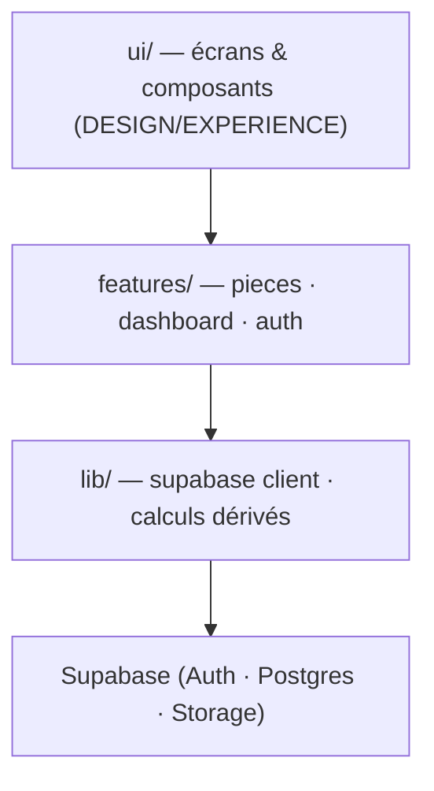
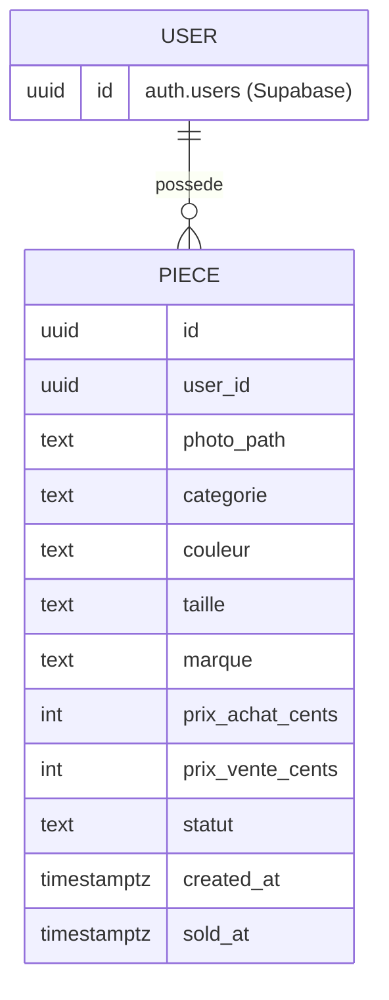

# Architecture Spine — Ilan · Stock & Marge

## Design Paradigm

**SPA client-side (React) sur BaaS (Supabase).** Le client est « fin » : il rend l'UI et orchestre les appels ; toute la persistance, l'auth et le stockage fichiers vivent dans Supabase. Pas de serveur applicatif maison.

Découpage en tranches par domaine (feature-sliced), dépendances dirigées vers le bas :



Règle de dépendance : `ui → features → lib → Supabase`. Rien ne dépend en sens inverse ; `lib` ne connaît pas `features`, `features` ne connaît pas `ui`.

## Invariants & Rules

### AD-1 — Supabase Postgres = source de vérité unique des Pièces `[ADOPTED]`
- **Binds:** toutes les données (Pièce, Stock, Historique)
- **Prevents:** copies locales divergentes, double source de vérité
- **Rule:** le client lit/écrit uniquement via `@supabase/supabase-js`. Aucun autre stockage n'est faisant-foi. Un cache local (offline) reste une vue, jamais l'autorité.

### AD-2 — Les métriques sont DÉRIVÉES, jamais stockées comme vérité `[ADOPTED]`
- **Binds:** Marge, Bénéfices, Argent dormant, Marge moyenne
- **Prevents:** chiffres périmés ou contradictoires (une marge stockée qui diverge de prix_achat/prix_vente)
- **Rule:** on ne persiste que les entrées brutes (`prix_achat`, `prix_vente`, `statut`, `sold_at`). Toute métrique est calculée à la lecture (vue SQL ou calcul côté client dans `lib/derive`). Marge moyenne = pondérée : `Σ(marge €) ÷ Σ(prix_achat)`.

### AD-3 — Écritures uniquement via le SDK supabase-js `[ADOPTED]`
- **Binds:** tous les mutateurs de données
- **Prevents:** deux propriétaires d'une même entité, chemins d'écriture concurrents
- **Rule:** aucune écriture DB directe ni second chemin de persistance. Une mutation = un appel supabase-js.

### AD-4 — Auth Supabase + Row-Level Security dès la v1 `[ADOPTED]`
- **Binds:** FR-1 et toute table de données
- **Prevents:** fuite de données, divergence lors de l'ouverture multi-utilisateur future
- **Rule:** chaque ligne porte un `user_id` ; une policy RLS filtre par `auth.uid()` sur chaque table. La sécurité ne repose jamais sur un filtrage côté client.

### AD-5 — Photos dans Supabase Storage, la Pièce stocke le chemin `[ADOPTED]`
- **Binds:** FR-2 (photo), FR-5 (fiche)
- **Prevents:** lignes DB alourdies par du binaire, gestion d'image incohérente
- **Rule:** l'image va dans un bucket Storage ; la Pièce stocke `photo_path` (référence), pas le fichier.

### AD-6 — Statut = enum fermé, pilote les agrégations
- **Binds:** FR-4, FR-6
- **Prevents:** chaînes de statut ad hoc, calculs faussés
- **Rule:** `statut ∈ {'en_stock','vendue'}`. Passage en `vendue` ⇒ `prix_vente` non nul + `sold_at` renseigné. Le statut réversible est autorisé (repasser en `en_stock` efface `sold_at`).

### AD-7 — L'offline est additif et différé
- **Binds:** FR (tous, pour le MVP)
- **Prevents:** couplage du MVP à un moteur de sync
- **Rule:** aucune fonctionnalité MVP ne dépend d'une écriture offline. L'offline s'ajoute plus tard (cache service-worker, puis Dexie.js) sans changer AD-1 : Supabase reste la source de vérité.

## Consistency Conventions

| Concern | Convention |
| --- | --- |
| Nommage | Colonnes DB `snake_case` ; TypeScript `camelCase` ; composants React `PascalCase`. Entité au singulier : `piece`. |
| Identifiants | `uuid` (défaut Supabase) pour toute clé primaire. |
| Dates | `timestamptz` en base, ISO 8601 en transit. `sold_at` nul tant que la Pièce est `en_stock`. |
| Argent | **Stocké en centimes entiers** (`prix_achat_cents`, `prix_vente_cents`) pour éviter les erreurs de flottant ; formaté en € à l'affichage. |
| Mutation & erreurs | Écriture via supabase-js (AD-3) ; erreurs remontées à l'UI en toasts/messages ; états de chargement explicites. |
| Config | Variables d'env `VITE_*` (URL + clé anon Supabase) ; jamais de secret service-role côté client. |
| Auth | Session gérée par Supabase Auth ; l'app charge son état de session au démarrage, redirige vers login si absent (EXPERIENCE : surface Auth). |

## Stack

| Name | Version |
| --- | --- |
| Vite | 8.0.9 |
| React | 19.2 |
| vite-plugin-pwa | 1.3.0 |
| TypeScript | 5.x `[ASSUMPTION — recommandé pour la sûreté ; JS pur possible si préféré]` |
| Tailwind CSS | 4.x `[ASSUMPTION — mappe bien les tokens DESIGN.md ; swappable]` |
| @supabase/supabase-js | 2.x |
| Supabase (Postgres) | cloud, région **EU** (RGPD, utilisateur FR) |
| Hébergement front | Cloudflare Pages / Vercel / Netlify (statique) |

## Structural Seed

Arborescence source (le code possède le détail ; ceci est l'échafaudage) :

```text
src/
  app/            # bootstrap, routing, garde d'auth, layout PWA
  features/
    auth/         # login, session (FR-1)
    pieces/       # ajout, fiche, édition, liste, filtres, statut (FR-2,3,4,5,8)
    dashboard/    # bénéfices, argent dormant, marge moyenne, alertes (FR-6,7,9)
  lib/
    supabase.ts   # client unique supabase-js
    derive.ts     # calculs dérivés (marge, agrégats) — AD-2
  components/ui/  # composants visuels (tokens DESIGN.md)
```

Modèle de données (noms + relations ; les attributs faisant-foi sont des AD) :



Déploiement & environnements : front statique buildé par Vite → CDN (Cloudflare Pages/Vercel) ; backend = projet Supabase managé (région EU). Deux environnements : `local` (dev) et `prod`. Caméra via API web standard (`getUserMedia` / `<input capture>`), sans dépendance de stack.

## Capability → Architecture Map

| Capability / FR | Lives in | Governed by |
| --- | --- | --- |
| FR-1 Auth | `features/auth` | AD-4 |
| FR-2 Ajouter pièce | `features/pieces` | AD-1, AD-3, AD-5, AD-6 |
| FR-3 Consulter/modifier | `features/pieces` | AD-1, AD-3 |
| FR-4 Passer en vendue | `features/pieces` | AD-6, AD-2 |
| FR-5 Calcul marge | `lib/derive` | AD-2 |
| FR-6 Dashboard 3 indicateurs | `features/dashboard` + `lib/derive` | AD-2 |
| FR-7 Sélecteur période (SHOULD) | `features/dashboard` | AD-2 |
| FR-8 Filtres (SHOULD) | `features/pieces` | conventions (requête filtrée) |
| FR-9 Alertes stagnation (COULD) | `features/dashboard` + `lib/derive` | AD-2 |

## Deferred

- **Offline (écriture + sync)** — AD-7 ; ajouter cache SW puis Dexie.js quand le COULD est promu ; pas de PowerSync tant que l'offline n'est pas central.
- **Source de la liste fermée catégories/couleurs** — constante front vs table de référence DB ; tranché au dev (défaut : constante partagée).
- **Vue SQL exacte de la marge moyenne pondérée** — détail d'implémentation (vue Postgres vs calcul client).
- **Système de style définitif** — si Tailwind n'est pas retenu.
- **Ouverture multi-utilisateur réelle** — l'infra RLS (AD-4) est prête ; l'UX multi-comptes reste v2+.
